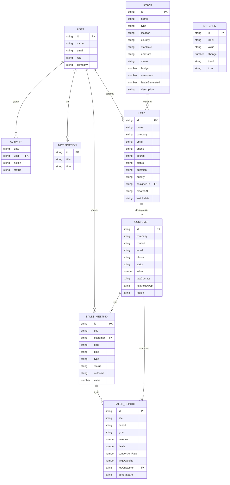

## Dijital Dönüşüm Dashboard

Modern, kurumsal görünümlü ve tamamen frontend mockup olarak tasarlanmış bir **admin panel / dashboard** projesi.  
Amaç, Doni Global Bilişim Teknolojileri için müşteri sunumlarında kullanılabilecek satış-demoları hazırlamak ve benim frontend yetkinliklerimi (React, grafikler, UI/UX) güçlü biçimde göstermek.

---

### 1. Teknolojiler

- **React 19 + TypeScript**
- **Vite** (geliştirme ve build)
- **React Router** (login + dashboard yönlendirmeleri)
- **Tailwind CSS** + **shadcn UI patternleri**
- **Recharts** (grafikler)
- **Radix UI** (dropdown, sheet, switch gibi primitive bileşenler)
- **Framer Motion** (mikro animasyonlar)

---

### 2. Özellikler

- **Login Sayfası**
  - Doni Global logosu (Artboard-1-copy-13.png → `public/doni-logo.png`)
  - Email + şifre alanları, “Dashboard’a giriş yap” butonu
  - Gradient arka plan, solda ürün açıklaması
  - Tamamen mock; 

- **Dashboard Ana Sayfa**
  - **Global filtreler**: Zaman (Bugün / Son 7 gün / Son 30 gün / Özel) + Segment (Tümü / Kurumsal / KOBİ / İç kullanıcı)
  - **KPI kartları**:
    - Toplam Gelir, Aktif Kullanıcı, Yeni Sipariş, Büyüme Oranı
    - Artış/azalış yüzdesi, ikonlar, arka plan geçişleri
    - Alt kısımda **Risk / Fırsat barı**
  - **Grafikler (Recharts)**:
    - Line Chart → Aylık Gelir (Ocak–Aralık)
    - Bar Chart → Haftalık Kullanıcı Aktivitesi
    - Hover tooltip, grid, gradient efektler
    - Gelir grafiğine tıklayınca ay bazlı “Operasyon Kuralları” başlığı güncelleniyor (drill-down hissi)
  - **Son Aktivite Tablosu**:
    - Tarih, Kullanıcı, İşlem, Durum
    - Tarihe veya kullanıcı adına göre sıralama (sortable kolonlar)
  - **Operasyon Kuralları**:
    - 3 adet mock otomasyon kuralı
    - Switch ile açık/kapalı simülasyonu
  - **Öne Çıkan İçgörüler (AI-like)**:
    - Büyüme, churn riski ve fırsat alanları için metinsel içgörüler
    - “AI-Like Demo” badge’i ile işaretlenmiş kart
  - **Canlı Aktivite Akışı (Mock realtime)**:
    - Her birkaç saniyede bir yeni satır ekleyen canlı feed
    -  yukarıdan aşağıya akış

- **Layout & Navigasyon**
  - **Sidebar (Sol Menü)**:
    - Doni Global logosu, “Dijital Dönüşüm Paneli” başlığı
    - Dashboard / Analytics / Users / Settings linkleri
    - Sürüm bilgisi kutusu
    - Logout butonu (mock – sadece frontend state’i sıfırlar)
    - Daraltılabilir (collapsed/expanded)
  - **Navbar (Üst Menü)**:
    - Mobilde hamburger menü + Sheet içinde sidebar
    - Arama çubuğu (mock)
    - Temalar (light / dark) – localStorage ile kalıcı
    - Bildirim menüsü (mock bildirim listesi)
    - Profil alanı: **Bayram Yusuf Yılmaz – Doni Global Bilişim Teknolojileri**

- **Layout Preset’leri (Görünüm Modları)**
  - KPI grid’i için 4 preset:
    - Genel, Yönetici, Satış, Operasyon
  - Her preset, kartların sıralamasını ve vurgusunu değiştirerek farklı hikayeler anlatır.

- **Presentation Mode**
  - Dashboard başlığındaki buton ile sunum modu aç/kapa
  - Başlık ve layout, toplantı/sunum senaryolarına uygun sade görünüme geçer.

- **Tema & Responsive**
  - Light/Dark tema; kullanıcı tercihi `localStorage` + `prefers-color-scheme` ile yönetiliyor.
  - Mobil:
    - Sidebar gizlenir, hamburger menü üzerinden açılır.
    - Kartlar tek sütuna düşer, grafikler tam genişlik olur.
  - Tablet ve Desktop için grid yapıları optimize edildi.

---

### 3. Projeyi Çalıştırma

Terminalde proje klasöründeyken:

```bash
npm install        # bir kez
npm run dev        # geliştirme sunucusu
```

Ardından tarayıcıda:

```text
http://localhost:5173
```

Build almak için:

```bash
npm run build
```

---

### 4. Dosya Yapısı (Özet)

```text
.
├─ public/
│  ├─ vite.svg
│  └─ doni-logo.png          # Artboard-1-copy-13.png'den kopyalanan logo
├─ src/
│  ├─ App.tsx                # Router + auth gate
│  ├─ main.tsx               # React root
│  ├─ index.css              # Tailwind + tema değişkenleri
│  ├─ components/
│  │  ├─ layout/
│  │  │  ├─ navbar.tsx
│  │  │  └─ sidebar.tsx
│  │  ├─ dashboard/
│  │  │  ├─ activity-chart.tsx
│  │  │  ├─ activity-table.tsx
│  │  │  ├─ global-filters.tsx
│  │  │  ├─ insights-panel.tsx
│  │  │  ├─ kpi-grid.tsx
│  │  │  ├─ live-activity-feed.tsx
│  │  │  └─ revenue-chart.tsx
│  │  ├─ ui/                 # button, card, table, dropdown, switch, sheet, avatar, badge...
│  │  ├─ theme-provider.tsx
│  │  └─ theme-toggle.tsx
│  ├─ data/
│  │  └─ mock.ts             # KPI, grafikler, aktiviteler, sidebar linkleri, bildirimler
│  ├─ layouts/
│  │  └─ dashboard-layout.tsx
│  └─ pages/
│     ├─ login.tsx
│     ├─ dashboard.tsx
│     └─ placeholder.tsx     # Analytics / Users / Settings için demo sayfalar
```

---

### 5. Akış Diyagramı (Flow Chart)

Aşağıdaki mermaid diyagramı, login → auth state → routing → dashboard akışını özetler:

```mermaid
flowchart TD
    A[Uygulama Açılışı] --> B{localStorage'da\n'dashboard-auth' var mı?}
    B -- Hayır --> C[Login Sayfası (/login)]
    B -- Evet --> D[Dashboard Layout (/)]

    C -->|Form submit| E[Mock kimlik doğrulama]
    E --> F[auth state = true,\nlocalStorage 'dashboard-auth' = true]
    F --> D

    D --> G[Navbar + Sidebar]
    G --> H{Route}

    H -- "/" --> I[DashboardPage]
    H -- "/analytics" --> J[Analytics Placeholder]
    H -- "/users" --> K[Users Placeholder]
    H -- "/settings" --> L[Settings Placeholder]

    I --> M[Global Filters]
    I --> N[KPI Grid + Presetler]
    I --> O[Revenue Chart + Drill-down]
    I --> P[Activity Chart]
    I --> Q[Activity Table]
    I --> R[Insights Panel + Live Feed]
    I --> S[Operasyon Kuralları]

    G -->|Logout| T[auth state = false,\nlocalStorage temizlenir]
    T --> C
```

Bu diyagramı GitHub gibi mermaid destekleyen ortamlarda doğrudan görselleştirebilir, ya da başka araçlarda referans olarak kullanabilirsin.

---

### 6. ER Diyagramı (Entity-Relationship)

Aşağıdaki ER diyagramı, projedeki mock veri yapılarını ve aralarındaki ilişkileri gösterir:



**İlişki Açıklamaları:**

- **USER → ACTIVITY**: Kullanıcılar sistemde aktivite gerçekleştirir (sipariş oluşturma, şifre değiştirme vb.)
- **USER → NOTIFICATION**: Kullanıcılar bildirimler alır
- **USER → SALES_MEETING**: Kullanıcılar satış toplantılarını yönetir
- **USER → LEAD**: Kullanıcılar lead'lere atanır (assignedTo)
- **CUSTOMER → SALES_MEETING**: Müşteriler için toplantılar düzenlenir
- **CUSTOMER → SALES_REPORT**: Müşteriler satış raporlarında yer alır
- **LEAD → CUSTOMER**: Lead'ler başarılı olduğunda müşteriye dönüştürülür
- **EVENT → LEAD**: Fuarlar ve etkinliklerden yeni lead'ler oluşur
- **SALES_MEETING → SALES_REPORT**: Toplantılar satış raporlarına dahil edilir

**Not:** Bu proje frontend-only bir mockup olduğu için gerçek bir veritabanı yok. Tüm veriler `src/data/mock.ts` dosyasında statik olarak tanımlanmıştır. ER diyagramı, gelecekte backend entegrasyonu için referans olarak kullanılabilir.


